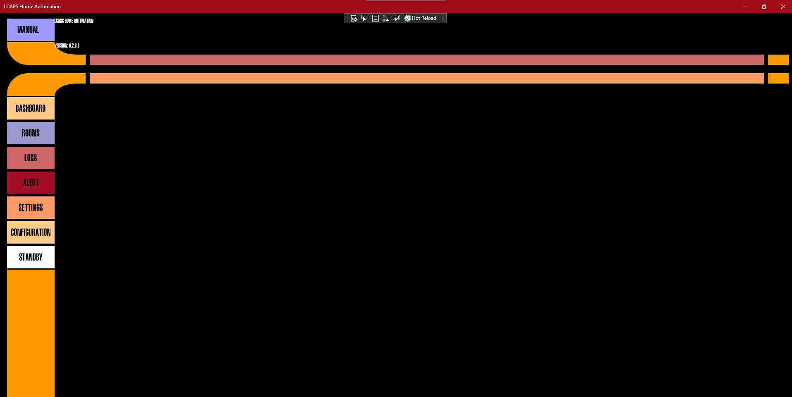
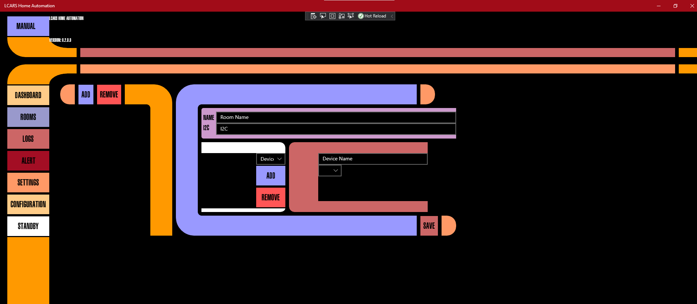
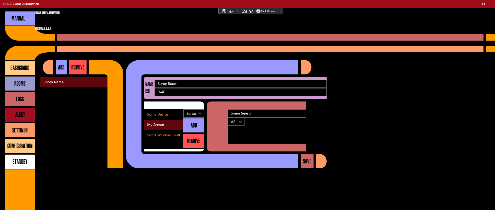
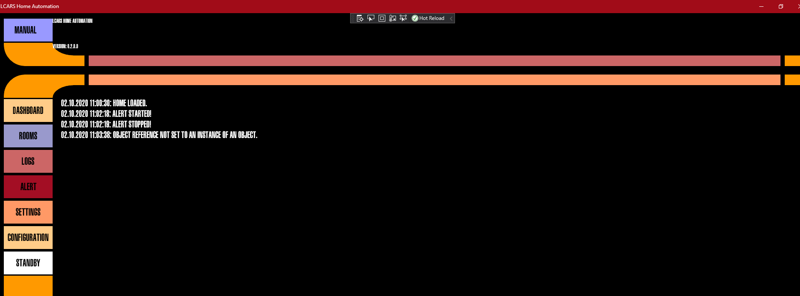
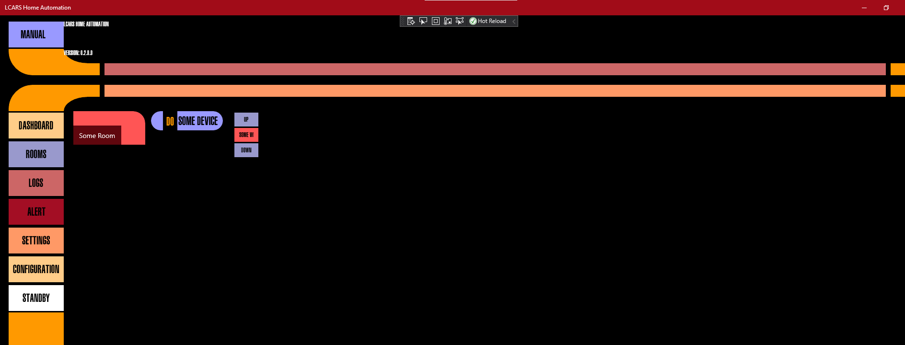

# LCARS Home Automation
Tried to realize some LCARS Style Home Automation using Raspberry Pi and Windows IoT.

Please be aware: Most of the code wont work due to deprecated SDKs or unfinished work.

The code partly based on this Project but was modified by me to fit my needs:
https://www.hackster.io/AnuragVasanwala/home-automation-using-raspberry-pi-2-and-windows-10-iot-0dcefc

Made the Project public for everyone who may be interested in it. Feel free to fork it.

Some Screenshots:

